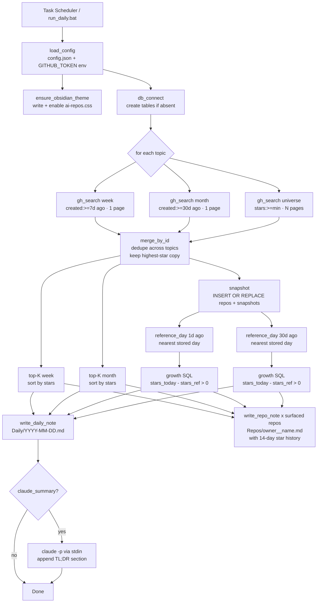
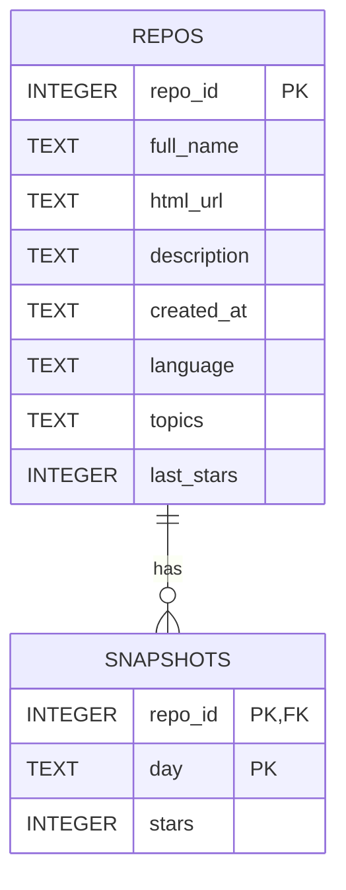

# Architecture — AI GitHub Repo Tracker

## Overview

`github_ai_tracker.py` is a single-file, stdlib-only Python script that runs once a day (via Windows Task Scheduler), queries the GitHub REST Search API across a set of configurable AI-related topics, and writes styled Markdown notes directly into a local Obsidian vault. It produces two kinds of output: a daily dashboard (`Daily/YYYY-MM-DD.md`) with four ranked tables (trending-this-week, trending-this-month, fastest-growing-24h, fastest-growing-30d), and one persistent per-repo note (`Repos/owner__name.md`) for every repo that surfaces in any table. Star-count history is stored in a local SQLite database (`snapshots.db`) so that growth velocity — which the GitHub API does not expose — can be computed by diffing today's snapshot against an earlier one.

---

## Component Breakdown

| Component | Functions | Responsibility |
|-----------|-----------|----------------|
| **Config loader** | `load_config()` | Reads `config.json`; env var `GITHUB_TOKEN` overrides the file value |
| **DB layer** | `db_connect()`, `snapshot()`, `reference_day()`, `growth()` | Schema creation, upsert of daily star counts, growth-diff query |
| **GitHub client** | `_get_json()`, `gh_search()` | Authenticated HTTP GET with retry/backoff; paginated search |
| **Normalizer / deduplicator** | `normalize()`, `merge_by_id()` | Canonicalizes raw API items; resolves the same repo appearing in multiple searches by keeping the highest-star copy |
| **Trending ranker** | inline in `run()` | Sorts the merged week/month sets by `stars` descending, slices to configured limits |
| **Growth ranker** | `growth()` SQL query | Joins today's snapshot against the nearest historical snapshot, returns positive deltas ranked by delta descending |
| **Markdown renderers** | `trending_table()`, `growth_table()`, `write_daily_note()`, `write_repo_note()` | Produces the 7-column tables and frontmatter-bearing note files |
| **Obsidian theme installer** | `ensure_obsidian_theme()` | Writes `ai-repos.css` to `.obsidian/snippets/` and enables it in `appearance.json` (preserving existing keys) |
| **Claude summarizer** | `maybe_claude_summary()` | Optionally pipes the finished daily note to `claude -p` via stdin and appends the output as `## TL;DR — video ideas` |
| **Self-test** | `selftest()` | In-memory SQLite fixture that verifies growth-diff + ranking correctness (`--selftest` flag) |
| **Scheduler** | `run_daily.bat` + Windows Task Scheduler | Triggers the daily run; `StartWhenAvailable` gives catch-up on missed mornings |

---

## Daily Run Data Flow



---

## SQLite Data Model

`snapshots.db` lives next to the script. Two tables:



`repos` holds the latest metadata for every repo ever fetched; it is upserted on every run so fields stay current. `snapshots` stores one row per `(repo_id, day)` — the composite primary key makes re-running on the same day idempotent (`INSERT OR REPLACE`). The `topics` column in `repos` is a comma-joined string (the API returns a list; Python serializes it to TEXT on write and splits it back on read in `write_repo_note`).

### Growth query

`growth()` joins the today snapshot against a reference snapshot, filters to positive deltas, and returns rows ordered by delta descending:

```sql
SELECT r.full_name, r.html_url, r.description, r.created_at,
       r.language, t.stars AS now, y.stars AS was, t.stars - y.stars AS delta
FROM   snapshots t
JOIN   snapshots y ON y.repo_id = t.repo_id AND y.day = :ref_day
JOIN   repos r ON r.repo_id = t.repo_id
WHERE  t.day = :today AND (t.stars - y.stars) > 0
ORDER  BY delta DESC LIMIT :limit
```

Repos with no prior snapshot are silently excluded by the inner JOIN — this is the correct behavior (no baseline to diff against).

`reference_day()` scans all distinct days stored before today and returns the one whose calendar distance to `(today - N days)` is smallest. This tolerates gaps in the history (missed runs, power-off days) rather than requiring an exact day match.

---

## Key Design Decisions

### 1. Single file, stdlib only

**Decision:** Everything lives in `github_ai_tracker.py`; `urllib`, `sqlite3`, `subprocess`, and `json` are the only imports.

**Rationale:** A personal automation tool with one user and one deployment site does not benefit from a package structure. Zero dependencies means zero `pip install`, no virtualenv, no dependency rot, and trivial portability to any machine with Python 3.10.

**Trade-off:** Adding a third-party HTTP library (e.g. `requests`) would make retry/backoff and rate-limit handling cleaner. The cost is deemed higher than the benefit for a single-file tool.

---

### 2. SQLite snapshots for velocity rather than the API

**Decision:** Star velocity is computed by diffing daily SQLite snapshots, not from any GitHub API field.

**Rationale:** GitHub's Search API sorts by `stars` (total) or `updated`, not by star velocity. There is no API field for "stars gained this week." Daily snapshots are the minimal viable approach; they require disk reads and a SQL join, but no extra network calls and no third-party analytics service.

**Trade-off:** The 24h growth list is empty until the second daily run; the 30d list is meaningfully populated only after ~30 runs. This cold-start behavior is documented in the README and surfaced in the empty-state message returned by `growth_table()`.

---

### 3. Three searches per topic, merged by repo ID

**Decision:** Each topic fires three separate searches — week, month, universe — and results are merged with `merge_by_id()`, keeping the highest-star copy of any repo that appears in multiple searches.

**Rationale:** The trending and universe searches have different date constraints and return different result sets. A repo trending this week will also appear in the universe search; deduplication ensures it counts once with the freshest (highest-star) data.

**Trade-off:** Three searches per topic multiplies API calls. With 8 topics from `config.example.json` and a universe of 3 pages each, a run makes `8 × (1 + 1 + 3) = 40` API calls. At 5000/hr authenticated this is negligible, but unauthenticated (60/hr) it will exhaust the limit and trigger backoff.

---

### 4. `SEARCH_DELAY` between pages, not between searches

**Decision:** `SEARCH_DELAY = 2.0` seconds is applied between consecutive *page* requests inside a single paginated `gh_search()` call, not between separate `gh_search()` invocations in the topic loop.

**Rationale:** Single-page requests (week, month, where `pages=1`) make exactly one HTTP call and exit; no sleep is needed or applied. The delay is relevant only for multi-page universe fetches. The GitHub Search API's secondary rate limit targets burst request patterns; spacing pages within a large paginated fetch is the effective mitigation.

**Trade-off:** The topic loop in `run()` issues multiple `gh_search()` calls with no inter-call sleep. In practice, the network round-trip and Python overhead provide natural spacing, and authenticated usage is well within primary rate limits.

---

### 5. Pure Markdown tables with escaped wikilink pipes

**Decision:** Tables are standard Markdown `|`-delimited tables. Repo links use Obsidian's `[[filename\|display]]` wikilink syntax with the pipe escaped as `\|`.

**Rationale:** An unescaped `|` inside a table cell is parsed as a column separator, which breaks the table. The backslash escape is the correct Obsidian Markdown workaround. Filenames use `owner__name` (double-underscore replacing `/`) so they are valid filesystem paths on Windows and macOS.

**Trade-off:** The description column additionally replaces any `|` characters with `/` (in `trunc()`) to prevent a second class of cell-breaking characters in repo descriptions.

---

### 6. CSS snippet + `cssclasses` for dark console UI

**Decision:** A hardcoded CSS snippet is written to `.obsidian/snippets/ai-repos.css` on every run and auto-enabled in `appearance.json`. Notes declare `cssclasses: [ai-digest]` or `cssclasses: [ai-repo]` in their frontmatter. Column coloring is done with CSS `td:nth-child(N)` selectors.

**Rationale:** Obsidian's CSS snippet system is the intended per-vault extension point. Scoping styles via `cssclasses` means the dark console aesthetic applies only to these notes and does not affect the rest of the vault. Auto-writing + auto-enabling the snippet means new users need zero manual Obsidian configuration.

**Trade-off:** `appearance.json` is parsed and rewritten by the script. If Obsidian adds or changes keys in that file, the preserve-existing-keys strategy (`data.get("enabledCssSnippets", [])` with a full re-write) should remain safe, but it is a best-effort write — failures are caught, logged, and skipped (the `ponytail: nice-to-have` comment in the code).

---

### 7. Claude generates text; Python writes the file

**Decision:** `maybe_claude_summary()` pipes the finished daily note to `claude -p` via stdin and Python appends the returned text. Claude does not write to disk.

**Rationale:** `claude -p` (print mode) returns generated text to stdout; it cannot reliably target arbitrary file paths. Keeping file I/O in Python ensures the append is atomic and encoding-safe (`utf-8`, `errors="replace"`). The entire step is wrapped in a broad `except Exception` so a missing or slow `claude` binary never aborts the data run.

**Trade-off:** `shell=True` is required because `claude` ships as a `.cmd` wrapper on Windows. This is acceptable for a local personal tool, not for a shared or networked system.

---

### 8. Local scheduling vs. cloud

**Decision:** Windows Task Scheduler with `StartWhenAvailable = true` runs the script. No cloud scheduler or hosted agent is used.

**Rationale:** The output is written to a local Obsidian vault on the same machine. A cloud agent has no way to reach the vault filesystem. Task Scheduler's `StartWhenAvailable` provides missed-run catch-up (laptop was off at 8am) without requiring always-on infrastructure. The tool is intentionally local-first and self-contained.

**Trade-off:** If the machine is off all day, the run is missed and that day has no snapshot. The growth lists tolerate gaps via `reference_day()`'s nearest-day logic, so a single missed day degrades gracefully.

---

## Failure Modes and Resilience

| Failure | Behavior |
|---------|----------|
| **Network error (URLError / TimeoutError / OSError)** | `_get_json()` retries up to 4 times with linear backoff (`5 × attempt` seconds). After 4 failures it returns `None`; `gh_search()` breaks its page loop and returns whatever it collected. |
| **Rate limit (HTTP 403 / 429)** | `_get_json()` reads the `Retry-After` header (defaults to 60s) and sleeps before retrying. Counts against the same 4-attempt budget. |
| **Other HTTP errors** | Logged and `None` returned; the search for that topic/page is skipped. |
| **No GitHub token** | The script warns and continues at 60 req/hr. A large topic list will likely hit the limit; backoff will slow the run but not crash it. |
| **growth lists empty (cold start)** | `growth()` returns `[]` when `ref_day` is `None`. `growth_table()` returns an explanatory placeholder string. The dashboard is written correctly with that placeholder. |
| **Claude unavailable** | `maybe_claude_summary()` catches all exceptions, prints a warning, and returns. The daily note is already fully written before this step runs. |
| **Appearance.json write failure** | Caught; user is instructed to enable the snippet manually in Obsidian settings. |
| **Partial topic fetch** | Topics that fail mid-fetch contribute whatever pages were retrieved. The run continues with the remaining topics. |
| **Re-run on the same day** | `INSERT OR REPLACE` on `snapshots(repo_id, day)` is idempotent. The daily note is overwritten (same path). The Claude summary step appends again if `claude_summary` is `true` — a known rough edge for same-day re-runs. |

---

## Security

**GitHub token handling**

- `config.json` (which may contain the token) is gitignored. The committed template `config.example.json` contains only placeholder strings.
- At runtime, `GITHUB_TOKEN` env var takes precedence over the config file value, allowing CI/headless environments to inject the token without writing it to disk.
- `_get_json()` only adds the `Authorization: Bearer` header when the token is non-empty and does not start with `"PUT_YOUR"`, so a misconfigured placeholder is never sent.
- The token requires no GitHub scopes — public repository search is unauthenticated at the API level; the token only lifts the rate limit.

**Local-only operation**

- No data is sent to any service other than `api.github.com`.
- The Claude summarizer step sends the daily note text to the local `claude` process over stdin (no network call from this script; any network call is `claude`'s responsibility).
- `snapshots.db` and generated Markdown notes contain only public GitHub metadata.

**`shell=True` in subprocess**

- Used only for the optional Claude step to resolve `claude.cmd` on Windows.
- The subprocess input is the content of the daily note (no user-controlled shell metacharacters); the command string is a literal constant. Risk surface is low for a local personal tool.

---

## Known Limitations

| Limitation | Notes |
|------------|-------|
| **Growth lists need history** | 24h list: needs ≥ 2 runs. 30d list: needs ~30 runs. First-run output has only trending tables. |
| **Windows-only scheduling** | `run_daily.bat` and the `schtasks` setup target Windows. On macOS/Linux, a `launchd` plist or cron job is the equivalent. |
| **Re-run appends Claude TL;DR twice** | If the script is run more than once on the same day with `claude_summary: true`, a second TL;DR section is appended to the existing daily note. |
| **Per-repo note churn** | Every run overwrites all surfaced repo notes, even if nothing changed. For vaults with git sync, this generates noisy diffs. A content-hash check before writing would suppress no-op writes. |
| **Universe is topic-tagged only** | Repos that are genuinely AI-related but lack the configured GitHub topics are invisible to the tracker. |
| **`reference_day()` is a linear scan** | Scans all distinct days in `snapshots`. For years of daily runs this remains trivially fast (SQLite, indexed by primary key), but worth noting. |

---

## Sensible Future Extensions

- **Cross-platform scheduling**: A single `schedule_setup.py` that detects OS and configures cron / launchd / Task Scheduler.
- **Suppress no-op repo note writes**: Hash the note body before writing; skip if unchanged. Reduces vault-git diff noise.
- **Configurable CSS theme**: Move color variables to `config.json` so users can switch from the dark console palette without editing Python source.
- **Multi-vault fan-out**: The `base` path is a single string; supporting a list of vault paths would allow mirroring the digest to multiple vaults.
- **Star-history sparkline**: The per-repo note already stores 14 snapshots; a simple ASCII sparkline or Obsidian DataView query could visualize momentum inline.
- **Topic discovery**: Auto-suggest additional topics by inspecting the `topics` field on highly-starred repos that already surfaced, without requiring manual `config.json` edits.
- **Deduplication of Claude TL;DR on re-run**: Check for an existing `## TL;DR` section before appending to handle same-day re-runs cleanly.
